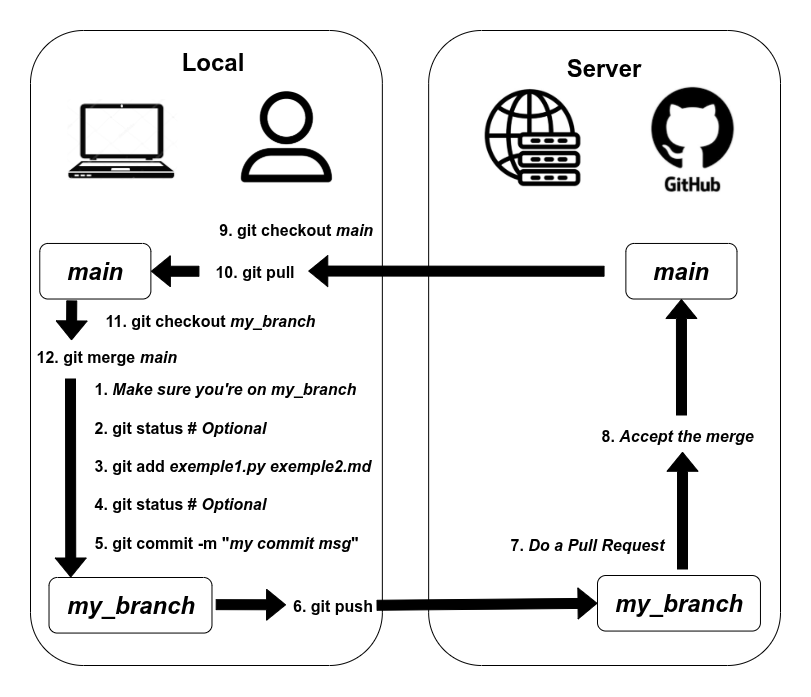

# 🧩 Git Basics – Quick Reference

This short guide covers the **essential Git commands** you'll need for the collaborative exercise.

---

## 🧠 What is Git?

**Git** was created by Linus Torvalds in 2005 for developing the Linux kernel. It has since become the most widely used version control system in the world.

**Git** is a version control system that allows you to:

- Track changes in your code over time
- Collaborate with others on the same project
- Revert to previous versions if needed
- Work on different features simultaneously (branches)

---

## ️️️️🔑 ️️️SSH keys and GitHub

First, make sure you have an SSH key pair set up on your local machine. This allows secure communication with GitHub without needing to enter your username and password every time.

To create an SSH key pair follow this tutorial.

https://docs.github.com/en/authentication/connecting-to-github-with-ssh/generating-a-new-ssh-key-and-adding-it-to-the-ssh-agent


## 📋 Basic Git Workflow

1. **Clone** a repository (download it to your machine)
2. **Make changes** to files
3. **Stage** your changes (prepare them for commit)
4. **Commit** your changes (save a snapshot)
5. **Push** your changes (upload to remote repository)

---

## 🔧 Essential Commands

There are many many Git commands, but here are the most essential ones you'll need.

### Clone a repository
```bash
git clone <repository-url>
```
Downloads a copy of the repository to your local machine.

### Check status
```bash
git status
```
Shows which files have been modified, staged, or are untracked.

### Stage changes
```bash
git add <file-name>        # Stage a specific file
git add .                  # Stage all changes (careful with this one!)
```
Prepares files to be committed.

### Commit changes
```bash
git commit -m "Your commit message"
```
Saves your staged changes with a descriptive message.

### Push changes
```bash
git push
```
Uploads your commits to the remote repository.

### Pull changes
```bash
git pull
```
Downloads and merges changes from the remote repository.

---

## 🌿 Working with Branches

### Create a new branch
```bash
git branch <branch-name>
```

### Switch to a branch
```bash
git checkout <branch-name>
```

### Create and switch to a new branch
```bash
git checkout -b <branch-name>
```

### Merge the main branch to another branch
```bash
git checkout <branch-name>     # Switch to the other branch
git merge main # Merge the main branch into the other branch
```
---

## ⚙️ Workflow

This image describes a typical Git workflow when collaborating with others.



## 💡 Best Practices

- ✅ Write **clear commit messages** (e.g., "Fix login bug" instead of "fix")
- ✅ **Commit often** – small, logical changes are easier to track
- ✅ **Pull before you push** – avoid conflicts by staying up-to-date
- ✅ Use **branches** for new features or experiments

---

## 📚 Resources

- [Official Git Documentation](https://git-scm.com/doc)
- [GitHub Git Cheat Sheet](https://education.github.com/git-cheat-sheet-education.pdf)