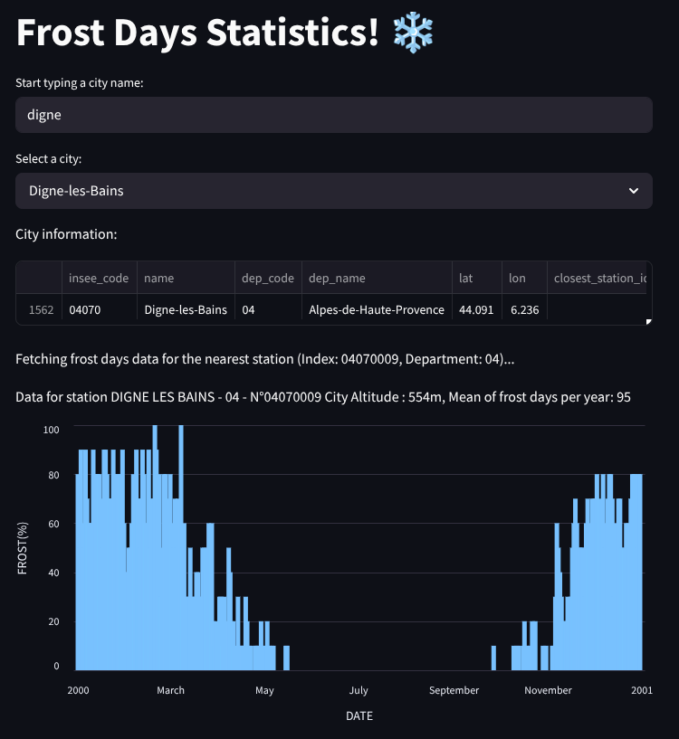

# ❄️ Frost App Challenge

If you're done with git, you can try to resolve this new challenge : create an app that will tell the user how many times frost has occured in a given location over a given period of time.

## Introduction

Frost is a weather phenomenon that occurs when the temperature drops below 0°C, causing water vapor in the air to freeze and form ice crystals. This can have a significant impact on agriculture, as frost can damage crops and reduce yields. In this challenge, you will create an app that allows users to check the number of frost days in a specific location over a given period of time.

## First steps

For now don't focus on the interface, just make sure you write functions that work.

The user must enter a city name, a start date and an end date. The app will then return the number of days with frost (temperature under 0°C) in that period for that city for each day in a typical year.

Output example :

 

## Data sources
You can find data on data.gouv.fr or other open data platforms. You'll probably need to find also data about the french cities. And find the coordinates of the cities and the weather stations to associate them.

## Tools
Use Python, Pandas, any API you want, any data source you want.

## Tips

Weather quality data is not great, you'll have to do some data cleaning and preprocessing.